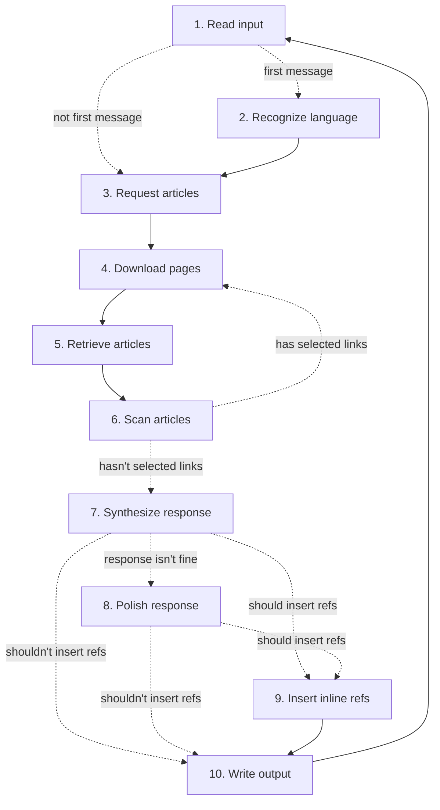

# WikiEtymoBot

<div align="center">
  
</div>

Интерактивный этимологический справочник — локально работающая AI-утилита, отвечающая на вопросы о происхождении слов
при помощи глубокого анализа информации из [Викисловаря](https://www.wiktionary.org/).


## 🎯 Назначение

Для людей, которые изучают новые языки или интересуются сравнительно-историческим языкознанием, Викисловарь может
служить мощным инструментом для исследования этимологии слов.
Однако он имеет три существенных ограничения:

1.  Статья зачастую содержит информацию только о ближайшем предке слова.
    Чтобы восстановить полную цепочку всех исторических форм слова вплоть до самой ранней известной, нужно
    последовательно переходить по гиперссылкам, что усложняет ручную проверку гипотез о дальнем родстве.

2.  Информация может быть разбросана по разным языковым разделам Викисловаря.
    Английский раздел является самым большим, но статьи, посвящённые словам из других языков, например, из русского,
    могут там отсутствовать или быть недостаточно подробными.
    Аналогичным образом, в русском разделе могут быть хуже представлены английские или латинские слова.
    Поэтому, чтобы получить наиболее полную картину, требуется искать слова сразу в нескольких языковых разделах.

3.  Несмотря на наличие в вики-разметке страницы специальных шаблонов, получение этимологии слова сложно
    автоматизировать программными средствами.
    Каждая статья уникальна по своей структуре: она может содержать ссылки на несколько предковых форм слова, несколько
    разных гипотез о его происхождении и другую полезную информацию, которую в общем случае нельзя извлечь с помощью
    регулярных выражений.

WikiEtymoBot позволяет обойти эти ограничения и облегчить поиск информации благодаря LLM-агенту, который самостоятельно
проводит исследование Викисловаря.
Он считывает вопрос на естественном языке, открывает нужные страницы в разных языковых разделах, находит в них разделы с
этимологией, переходит по подходящим гиперссылкам, чтобы собрать как можно больше информации о дальних предках слова, а
затем синтезирует собранную информацию в сжатый ответ и приводит список использованных источников.


## 🖥️ Системные требования

- Python 3.12 или новее.

- [Ollama](https://ollama.com/).

- GPU с достаточным объёмом памяти для инференса LLM и вычислений векторных представлений текста.

  В качестве LLM по умолчанию используется `qwen3:14b`, но можно использовать `qwen3:8b` или более крупные модели из
  этого семейства.
  Для векторного представления текста можно использовать любую модель (по умолчанию используется `embeddinggemma:300m`).


## 📥 Установка

1.  **Склонировать GitHub-репозиторий:**

    ```bash
    git clone https://github.com/n-govorukhin/WikiEtymoBot.git
    cd WikiEtymoBot
    ```

2.  **Установить Python-пакет:**

    ```bash
    python -m pip install .
    ```

3.  **Скачать модели для Ollama:**

    ```bash
    ollama pull qwen3:14b
    ollama pull embeddinggemma:300m
    ```

    Если используются другие модели, то их названия нужно указать при запуске приложения через параметры `--llm` и
    `--embeddings`.


## 🚀 Запуск

Приложение можно запускать в двух режимах:

1.  **Командный режим:**

    ```bash
    wikietymobot "Откуда произошло слово яблоко?"
    ```

    Вопрос передаётся через аргументы командной строки, утилита возвращает ответ на него и завершает работу.

2.  **Диалоговый режим:**

    ```bash
    wikietymobot
    > "Откуда произошло слово яблоко?"
    ```

    Утилита открывает специальный чат, считывает оттуда вопрос, отвечает на него, а затем может принимать новые
    вопросы в том же чате.
    Завершить чат можно с помощью команды `/exit`.

    ⚠️ **Важное замечание:**

    После ответа на основной вопрос чат рекомендуется использовать только для уточнений или связанных вопросов.
    Чтобы задать вопрос по другой теме, следует открыть новый чат.
    Если задавать много разных вопросов в одном чате, качество ответов может деградировать из-за засорения контекста.


## 💡 Примеры использования

WikiEtymoBot может отвечать на любые вопросы об этимологии слов, заданные в свободной форме.
Ниже приведено несколько полезных сценариев его использования.

### 1. Исследование истории происхождения слова

Если задать вопрос о происхождении какого-нибудь слова, WikiEtymoBot найдёт соответствующую ему статью в Викисловаре,
рекурсивно пройдёт по гиперссылкам, чтобы собрать информацию о его предках, затем синтезирует информацию из собранных
источников и напишет краткий ответ, в котором будет представлена цепочка всех известных форм слова: от более современных к
более древним.

```
> Откуда произошло слово петрушка?

Слово «петрушка» в русском языке заимствовано из польского «pietruszka», адаптированного из чешского
«petržel», от средневерхонемецкого «petersîlje», от латинского «petroselīnum», от древнегреческого
«πετροσέλινον» (от «πέτρος» — «камень» + «σέλινον» — «сельдерей», заимствованное из
неиндоевропейского источника, возможно, предгреческого).

[^1]: https://en.wiktionary.org/wiki/Petersilie#German
[^2]: https://en.wiktionary.org/wiki/petroselinum#Latin
[^3]: https://en.wiktionary.org/wiki/petržel#Czech
[^4]: https://en.wiktionary.org/wiki/pietruszka#Polish
[^5]: https://en.wiktionary.org/wiki/πέτρος#Ancient_Greek
[^6]: https://en.wiktionary.org/wiki/πετροσέλινον#Ancient_Greek
[^7]: https://en.wiktionary.org/wiki/σέλινον#Ancient_Greek
[^8]: https://en.wiktionary.org/wiki/петрушка#Russian
[^9]: https://ru.wiktionary.org/wiki/petroselinum#Латинский
[^10]: https://ru.wiktionary.org/wiki/pietruszka#Польский
[^11]: https://ru.wiktionary.org/wiki/петрушка#Русский
```

```
> Откуда произошло слово бульдозер?

Слово «бульдозер» в русском языке заимствовано из английского «bulldozer», которое происходит от
«bulldoze» + суффикс «-er»; «bulldoze» образовано от «bull» (древнеанглийское и древнескандинавское,
от прагерманского *bulô, от праиндоевропейского *bʰl̥no-/*bʰel-) и «dose» (заимствовано из
французского, от латинского dosis, от древнегреческого δόσις, от δίδωμι «давать», от
праиндоевропейского *déh₃tis).

[^1]: https://en.wiktionary.org/wiki/bole#Middle_English
[^2]: https://en.wiktionary.org/wiki/bull#English
[^3]: https://en.wiktionary.org/wiki/bulldoze#English
[^4]: https://en.wiktionary.org/wiki/bulldozer#English
[^5]: https://en.wiktionary.org/wiki/dose#English
[^6]: https://en.wiktionary.org/wiki/dosis#Latin
[^7]: https://en.wiktionary.org/wiki/δίδωμι#Ancient_Greek
[^8]: https://en.wiktionary.org/wiki/δόσις#Ancient_Greek
[^9]: https://en.wiktionary.org/wiki/бульдозер#Russian
[^10]: https://ru.wiktionary.org/wiki/bulldozer#Французский
[^11]: https://ru.wiktionary.org/wiki/бульдозер#Русский
```


### 2. Проверка гипотез о родстве слов

Предметом вопроса могут быть сразу несколько слов, и WikiEtymoBot может исследовать, как они связаны друг с другом.
Например, он может проверить, являются ли они когнатами (словами, происходящими от общего предка).

```
> Слова воля и will имеют общий корень?

Да, слова «воля» и «will» имеют общий корень, поскольку слово «воля» в русском языке восходит к
праславянскому *voľà, от которого происходит прабалтославянское *wáljāˀ, а затем к
праиндоевропейскому *welh₁-, что совпадает с этимологией английского «will», восходящего к
праиндоевропейскому *welh₁- через прагерманское *wiljô и староанглийское «willa».

[^1]: https://en.wiktionary.org/wiki/will#English
[^2]: https://en.wiktionary.org/wiki/willa#Old_English
[^3]: https://en.wiktionary.org/wiki/wille#Middle_English
[^4]: https://en.wiktionary.org/wiki/воля#Russian
[^5]: https://en.wiktionary.org/wiki/волꙗ#Old_Church_Slavonic
[^6]: https://ru.wiktionary.org/wiki/will#Английский
[^7]: https://ru.wiktionary.org/wiki/воля#Русский
[^8]: https://ru.wiktionary.org/wiki/волꙗ#Старославянский
```

```
Слова дремать и dream имеют общий корень?

Слово «dream» в английском языке происходит из древнеанглийского «drēam», из пра-западногерманского
*draum, из прагерманского *draumaz, из более раннего *draugmaz, из праиндоевропейского *dʰrowgʰ-mos,
из *dʰrewgʰ- «обман, навредить, повредить», а слово «дремать» в русском языке происходит от
праславянского *drěmati, от праиндоевропейского *dre- «спать», поэтому слова «dream» и «дремать» не
имеют общего корня.

[^1]: https://en.wiktionary.org/wiki/dream#English
[^2]: https://en.wiktionary.org/wiki/drem#Middle_English
[^3]: https://en.wiktionary.org/wiki/дремать#Russian
[^4]: https://ru.wiktionary.org/wiki/dream#Английский
[^5]: https://ru.wiktionary.org/wiki/дремать#Русский
```


### 3. Ответы на уточняющие вопросы

Когда WikiEtymoBot работает в диалоговом режиме, он хранит историю сообщений и все загруженные источники, поэтому после
ответа на основной вопрос ему можно задавать любые уточняющие.
Если WikiEtymoBot посчитает, что имеющихся источников недостаточно для ответа на очередной опрос, то он динамически
подгрузит новые.

```
> Откуда в английском языке слово red?

Слово red в английском языке восходит к праиндоевропейскому корню *h₁rowdʰós (или *reudh-), через
пра-германский *raudaz, древнеанглийский rēad и среднеанглийский red, как указано в статьях.

[^1]: https://en.wiktionary.org/wiki/red#English
[^2]: https://ru.wiktionary.org/wiki/*raudaz#Прагерманский
[^3]: https://ru.wiktionary.org/wiki/red#Английский

> Оно случайно не родственно слову руда?

Слово red (английский) и руда (русский) действительно связаны через общий праиндоевропейский корень
*reudh- / *h₁rowdʰós* («красный»), но их развитие в разных языковых ветвях привело к различиям в
значении и форме, так как red происходит от пра-германского *raudaz, а руда — от праславянского
*ruda, и хотя оба слова первоначально означали «красный», в современном английском red означает
цвет, а в русском руда — минерал.

[^4]: https://en.wiktionary.org/wiki/руда#Russian
[^5]: https://ru.wiktionary.org/wiki/руда#Русский
```


## ⚙️ Принцип работы

Алгоритм работы агента состоит из следующий шагов:

1.  Считывается вопрос, заданный пользователем.

2.  Определяется язык, на котором задан вопрос.

    Этот шаг выполняется только в самом начале диалога, а затем пропускается.

3.  Выбираются слова, которые нужно найти в словаре, чтобы ответить на вопрос.

4.  Для каждого слова скачиваются статьи сразу на трёх языках:
    - на языке, к которому относится слово;
    - на языке, на котором задан вопрос;
    - на английском языке.

    Например, если вопрос «Откуда в немецком языке слово Zeit?», то статья «Zeit» будет скачана из немецкого, русского
    и английского языковых разделов Викисловаря.

5.  Из скачанных статей извлекаются разделы с этимологией.

    Если у слова есть несколько значений и для каждого приведена отдельная этимология, то среди них выбирается та,
    которая больше всего подходит по смыслу, исходя из текущего контекста.

6.  Из выбранных разделов извлекаются ссылки.
    Среди них отбираются только те, которые ведут на статьи, посвящённые предковым формам слова.

    - Если нашлась хотя бы одна подходящая ссылка, то алгоритм возвращается к шагу 4 и повторяет цикл для новых статей.

    - Если ссылок не нашлось, то алгоритм переходит к шагу 7.

    Таким образом, цикл из шагов 4–6 повторяется до тех пор, пока для каждого слова не будет собрано полное
    «генеалогическое древо».

7.  Генерируется ответ на вопрос с использованием информации из всех собранных статей (RAG).

8.  Ответ переписывается с учётом требований к форматированию текста.

    Этот шаг выполняется только в том случае, если текст первоначального ответа содержит недопустимые элементы,
    например, списки или Markdown-разметку.

9.  В нужных местах ответа [вставляются сноски на источники утверждений](#вставка-сносок-на-источники-утверждений).

    Этот шаг выполняется только если включена настройка `--inline-refs`.

10. В конец ответа программно добавляется список ссылок на использованные статьи со сквозной нумерацией.
    Полученный ответ отправляется пользователю, после чего алгоритм возвращается к шагу 1, чтобы обработать новый
    вопрос.


## 🔃 Схема алгоритма





## 🔧 Настройки

Утилита имеет ряд настроек, полный список которых можно посмотреть с помощью опции `--help`.
Эти настройки можно передавать как через аргументы командной строки, так и через переменные окружения с префиксом
`wikietymobot_` (например, `wikietymobot_log_level`).


## ✨ Возможности

### Логирование

Опция `--log-level` позволяет включить логирование и проследить, как агент анализирует вопрос и собирает данные.

```
cli.py "Откуда слово дипломат?" --log-level info
Recognized the language: Russian.
Decided to search "дипломат" (Russian).
Requested article en.wiktionary.org/wiki/дипломат#Russian (Russian).
Requested article ru.wiktionary.org/wiki/дипломат#Russian (Russian).
Requested link en.wiktionary.org/wiki/дипломат#Russian → en.wiktionary.org/wiki/diplomate#French.
Requested link en.wiktionary.org/wiki/diplomate#French → en.wiktionary.org/wiki/diplomatique#French.
Requested link en.wiktionary.org/wiki/diplomatique#French → en.wiktionary.org/wiki/diplomaticus#Latin.
Requested link en.wiktionary.org/wiki/diplomaticus#Latin → en.wiktionary.org/wiki/diploma#Latin.
Requested link en.wiktionary.org/wiki/diploma#Latin → en.wiktionary.org/wiki/δίπλωμα#Ancient_Greek.
Requested link en.wiktionary.org/wiki/δίπλωμα#Ancient_Greek → en.wiktionary.org/wiki/διπλόω#Ancient_Greek.
Requested link en.wiktionary.org/wiki/διπλόω#Ancient_Greek → en.wiktionary.org/wiki/διπλόος#Ancient_Greek. 
```

Можно видеть, что агент многократно переходил по гиперссылкам, чтобы дойти до самых древних корней слова.


### Вставка сносок на источники утверждений

Опция `--inline-refs` позволяет сделать так, чтобы в ответе после каждого утверждения шла сноска на статью, которая его
подтверждает.

```
> Откуда произошло слово батут?

Слово «батут» на русском языке заимствовано из французского «batoude» [^6], которое происходит от
итальянского «battuta» [^5], образованного от прошедшего причастия женского рода от «battere»
(«бить») [^5], которое унаследовано от латинского «battere» [^2], восходящего к более ранней форме
«battuere» («бить, ударять») [^2], происходящей, возможно, от галльского или германского, и уходящей
корнями к праиндоевропейскому *bʰedʰh₂- («ударить») или *bʰat- («ударить»), а также к
праиндоевропейскому *bhau- («бить») [^4].

[^1]: https://en.wiktionary.org/wiki/batoude#French
[^2]: https://en.wiktionary.org/wiki/battere#Italian
[^3]: https://en.wiktionary.org/wiki/batto#Latin
[^4]: https://en.wiktionary.org/wiki/battuo#Latin
[^5]: https://en.wiktionary.org/wiki/battuta#Italian
[^6]: https://en.wiktionary.org/wiki/батут#Russian
[^7]: https://ru.wiktionary.org/wiki/battere#Итальянский
[^8]: https://ru.wiktionary.org/wiki/battuta#Итальянский
[^9]: https://ru.wiktionary.org/wiki/батут#Русский
```


### Защита от галлюцинаций

WikiEtymoBot использует в ответе только ту информацию, которая есть в статьях.
Если не нашлось ни одной статьи, то он откажется отвечать на вопрос, даже если интересующее слово реально существует.

```
> Какая этимология у слова гиперфиксация?

Я не могу ответить на этот вопрос, потому что у меня нет информации о происхождении слова «гиперфиксация».
```


### Reasoning

В Ollama поддерживается режим размышлений для Qwen 3.
По умолчанию он включается только на этапе генерации ответа, но этим можно управлять с помощью параметра `--reasoning`.
Например, `--reasoning reference_inserter` включает размышления перед вставкой сносок на источники, а
`--reasoning off` выключает их везде.


### Prompt engineering

Если требуется скорректировать формат ответа или подстроить агента под новые сценарии, это можно сделать с помощью
LLM-промптов.
Промпты, используемые по умолчанию, хранятся в файле
[resources/prompt_templates.yaml](/resources/prompt_templates.yaml).
Можно скопировать папку `resources`, изменить в ней содержимое файла `prompt_templates.yaml` и указать путь к новой
папке с помощью параметра `--resources`.


### Кеширование

Страницы, скачанные из Викисловаря, и ответы, сгенерированные LLM, по умолчанию кешируются в папку
`~/.wikietymobot/cache/`.
Отключить кеширование можно указав `--no-cache http` или `--no-cache llm`.


## 🚧 Ограничения

- LLM может делать ошибки в ответе, поэтому для полной уверенности рекомендуется проверять источники вручную.
  Использование RAG, reasoning и жёстких системных промптов сводит к минимуму вероятность генерации полностью ложных или
  необоснованных ответов, однако в редких случаях ответ может содержать мелкие ошибки, например, перепутанные местами
  слова, неправильно переведённые термины и тому подобное.

- Викисловарь, как и Википедия, представляет из себя проект, который может редактировать любой участник, поэтому
  статьи оттуда (и, [как следствие](https://en.wikipedia.org/wiki/Garbage_in,_garbage_out), сгенерированный ответ) могут
  содержать непроверенные или ошибочные сведения.

- API Викисловаря не любит частые запросы и может временно банить IP-адрес, с которого они поступают.
  Если эта проблема повторяется, то рекомендуется увеличить время ожидания между запросами с помощью параметра
  `--wiktionary.request-delay` и убедиться, что не используются параллельные запросы (параметр
  `--wiktionary.concurrency-limit`).
